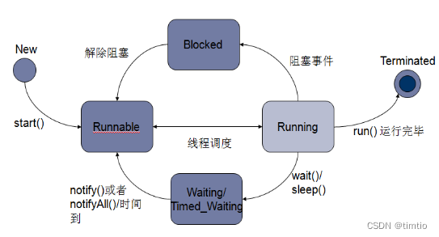

>线程的五种状态

1.新建状态（New）：
创建一个新的线程对象。

2.就绪状态（Runnable）:

线程创建对象后，其他线程调用start()方法，该线程处于就绪状态，资源已经准备就绪，等待CPU资源。

3.运行状态（Running）：

处于就绪状态的线程获取到CPU资源后进入运行状态。

4.阻塞状态（Blocked）：

阻塞状态是线程由于某些原因放弃CPU使用，暂时停止运行。

（1）等待阻塞：线程调用start（）方法，JVM会把这个线程放入等待池中，该线程需要其他线程调用notify()或notifyAll()方法才能被唤醒。

（2）同步阻塞：运行的线程在获取对象的同步锁时，若该同步锁被其他线程占用，则JVM会把该线程放入锁池中。

（3）其他阻塞：运行的线程执行sleep()或join()方法，或者发出了I/O请求时，JVM会把该线程置为阻塞状态。当sleep()状态超时、join()等待线程终止或者超时、或者I/O处理完毕时，线程重新转入就绪状态。

5.终止状态（Terminated）：

线程run（）方法运行完毕，该线程结束。

41. sleep() 和 wait() 有什么区别？
    类的不同：sleep() 来自 Thread，wait() 来自 Object。
    释放锁：sleep() 不释放锁；wait() 释放锁。
    用法不同：sleep() 时间到会自动恢复；wait() 可以使用 notify()/notifyAll()直接唤醒。

42. notify()和 notifyAll()有什么区别？
    notifyAll()会唤醒所有的线程，notify()之后唤醒一个线程。notifyAll() 调用后，会将全部线程由等
    待池移到锁池，然后参与锁的竞争，竞争成功则继续执行，如果不成功则留在锁池等待锁被释放后再次参
    与竞争。而 notify()只会唤醒一个线程，具体唤醒哪一个线程由虚拟机控制。
44. 创建线程池有哪几种方式？
    线程池创建有七种方式，最核心的是最后一种：
    newSingleThreadExecutor()：它的特点在于工作线程数目被限制为 1，操作一个无界的工作队列，所以
    它保证了所有任务的都是被顺序执行，最多会有一个任务处于活动状态，并且不允许使用者改动线程池实
    例，因此可以避免其改变线程数目；
    newCachedThreadPool()：它是一种用来处理大量短时间工作任务的线程池，具有几个鲜明特点：它会试
    图缓存线程并重用，当无缓存线程可用时，就会创建新的工作线程；如果线程闲置的时间超过 60 秒，则
    被终止并移出缓存；长时间闲置时，这种线程池，不会消耗什么资源。其内部使用 SynchronousQueue 作
    为工作队列；
    newFixedThreadPool(int nThreads)：重用指定数目（nThreads）的线程，其背后使用的是无界的工作队
    列，任何时候最多有 nThreads 个工作线程是活动的。这意味着，如果任务数量超过了活动队列数目，将
    在工作队列中等待空闲线程出现；如果有工作线程退出，将会有新的工作线程被创建，以补足指定的数目
    nThreads；
    newSingleThreadScheduledExecutor()：创建单线程池，返回 ScheduledExecutorService，可以进行定
    时或周期性的工作调度；
    newScheduledThreadPool(int corePoolSize)：和 newSingleThreadScheduledExecutor()类似，创建的
    是个 ScheduledExecutorService，可以进行定时或周期性的工作调度，区别在于单一工作线程还是多个
    工作线程；
    newWorkStealingPool(int parallelism)：这是一个经常被人忽略的线程池，Java 8 才加入这个创建方
    法，其内部会构建 ForkJoinPool，利用 Work-Stealing 算法，并行地处理任务，不保证处理顺序；
    ThreadPoolExecutor()：是最原始的线程池创建，上面 1-3 创建方式都是对 ThreadPoolExecutor 的封
    装。

1. Executors.newFixedThreadPool：创建⼀个固定⼤⼩的线程池，可控制并发的线程数，超出的线程会在队列中等待；
2. Executors.newCachedThreadPool：创建⼀个可缓存的线程池，若线程数超过处理所需，缓存⼀段时间后会回收，若线程数不够，则新建线程；
3. Executors.newSingleThreadExecutor：创建单个线程数的线程池，它可以保证先进先出的执⾏顺序；
4. Executors.newScheduledThreadPool：创建⼀个可以执⾏延迟任务的线程池；
5. Executors.newSingleThreadScheduledExecutor：创建⼀个单线程的可以执⾏延迟任务的线程池；
6. Executors.newWorkStealingPool：创建⼀个抢占式执⾏的线程池（任务执⾏顺序不确定）【JDK1.8 添加】。
7. ThreadPoolExecutor：最原始的创建线程池的⽅式，它包含了 7 个参数可供设置，后⾯会详细讲。

1）有界队列：

SynchronousQueue ：一个不存储元素的阻塞队列，每个插入操作必须等到另一个线程调用移除操作，否则插入操作一直处于 阻塞状态，吞吐量通常要高于LinkedBlockingQueue，静态工厂方法 Executors.newCachedThreadPool 使用了这个队列。
ArrayBlockingQueue：一个由数组支持的有界阻塞队列。此队列按 FIFO（先进先出）原则对元素进行排序。一旦创建了这样的缓存区，就不能再增加其容量。试图向已满队列中放入元素会导致操作受阻塞；试图从空队列中提取元素将导致类似阻塞。
2）无界队列：

LinkedBlockingQueue：基于链表结构的无界阻塞队列，它可以指定容量也可以不指定容量（实际上任何无限容量的队列/栈都是有容量的，这个容量就是Integer.MAX_VALUE）
PriorityBlockingQueue：是一个按照优先级进行内部元素排序的无界阻塞队列。队列中的元素必须实现 Comparable 接口，这样才能通过实现compareTo()方法进行排序。优先级最高的元素将始终排在队列的头部；PriorityBlockingQueue 不会保证优先级一样的元素的排序。
